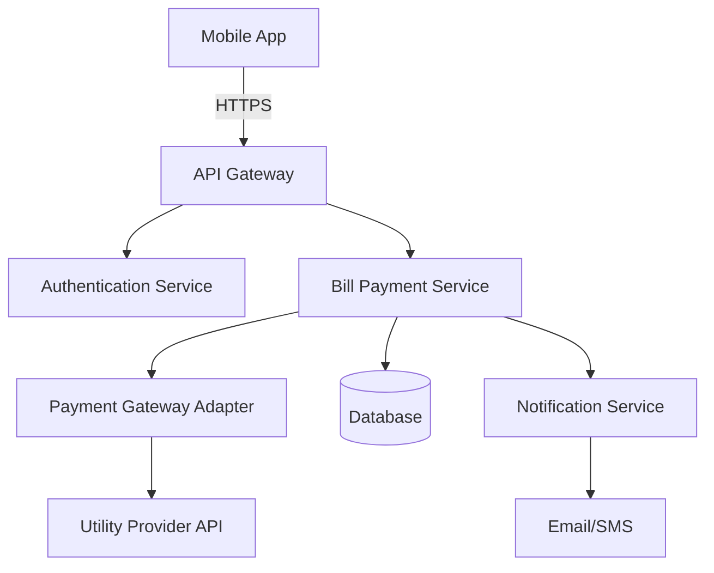

# Implementing SDLC in Real-World Projects: A Practical Guide

**Audience:** Intermediate engineers | **Duration:** 30 min

## Learning Objectives

By the end of this lesson, you will be able to:

1. Apply SDLC principles to structure a real software project from inception to delivery
2. Create phase-specific deliverables and documentation that guide development teams
3. Identify and implement appropriate SDLC methodologies based on project constraints
4. Establish quality gates and checkpoints between SDLC phases to ensure project success
5. Integrate modern tools and automation into each SDLC phase for improved efficiency

## Introduction

Imagine you're tasked with building a customer relationship management (CRM) system for a mid-sized company. Where do you start? How do you ensure the final product meets business needs? How do you coordinate between designers, developers, testers, and stakeholders? This is where the Software Development Lifecycle (SDLC) becomes your roadmap.

The SDLC is more than just a theoretical framework—it's a practical methodology that transforms chaotic development into a structured, predictable process. "The SDLC breaks down software development into distinct, repeatable, interdependent phases. Each phase of the SDLC has its own objectives and deliverables that guide the next phase" [1]. This structured approach reduces risks, improves quality, and ensures that everyone on the team understands what needs to happen and when.

In today's fast-paced development environment, understanding how to implement SDLC effectively is crucial for intermediate engineers. You're no longer just writing code—you're participating in the entire software creation process. You need to understand how your work fits into the bigger picture, how to collaborate across phases, and how to deliver value consistently.

This lesson focuses on the practical implementation of SDLC in real projects. We'll explore how to transition between phases, create meaningful deliverables, choose the right SDLC model for your context, and avoid common implementation pitfalls.

## Core Concept: SDLC Phases

The Software Development Lifecycle (SDLC) consists of seven key phases that work together to deliver quality software:

```
┌─────────────────────────────────────────────────────────────┐
│                    SDLC PHASE FLOW                          │
└─────────────────────────────────────────────────────────────┘

    ┌──────────┐
    │ PLANNING │  Define scope, resources, timeline
    └────┬─────┘
         │
         ▼
┌────────────────┐
│  REQUIREMENTS  │  Gather stakeholder needs
└───────┬────────┘
        │
        ▼
   ┌────────┐
   │ DESIGN │  Create architecture & blueprints
   └────┬───┘
        │
        ▼
   ┌────────┐
   │ CODING │  Build the actual software
   └────┬───┘
        │
        ▼
  ┌─────────┐
  │ TESTING │  Verify quality & functionality
  └────┬────┘
       │
       ▼
┌──────────────┐
│  DEPLOYMENT  │  Release to production
└──────┬───────┘
       │
       ▼
┌──────────────┐
│ MAINTENANCE  │  Ongoing support & updates
└──────────────┘
       │
       └──────────┐ (Feedback Loop)
                  │
                  └──────────────────────┐
                                         │
                                         ▼
                              Back to PLANNING for next iteration
```

### Phase 1: Planning

The planning phase is the foundation of any successful software development project. Project goals, objectives, and requirements are gathered and documented during this phase [3].

**Key Deliverables:**
- Project charter with scope and objectives
- Budget and resource allocation
- Timeline with milestones
- Risk assessment and mitigation strategies
- Success metrics and KPIs

**Stakeholders Involved:**
- Product managers
- Engineering leads
- Business analysts
- Executives

### Phase 2: Requirements Analysis

During this phase, the development team collects requirements from several stakeholders such as customers, internal and external experts, and managers to create a software requirement specification document [4].

**Key Deliverables:**
- Functional requirements (what the system must do)
- Non-functional requirements (performance, security, scalability)
- User stories with acceptance criteria
- Use case diagrams
- Requirements traceability matrix

**Example Requirements Structure:**

```
Requirement: FR-001
Description: User can search for utility provider by name
Priority: Must-have
Acceptance Criteria:
  ✓ Search returns results within 2 seconds
  ✓ Supports partial name matching
  ✓ Shows provider logo and payment methods
```

### Phase 3: Design

The design phase involves creating the architecture of the software. This includes defining the overall system architecture, database design, and user interface design [5].

**Key Deliverables:**
- System architecture diagrams
- Database schema
- API specifications
- UI/UX mockups and wireframes
- Security design
- Design review and approval

**System Architecture Example:**



### Phase 4: Coding (Implementation)

In the coding phase, developers write the actual code based on the design documents. This phase is where the software is built, and it requires careful attention to detail [6].

**Key Activities:**
- Writing clean, maintainable code
- Following coding standards and conventions
- Conducting code reviews
- Version control (Git commits, branches)
- Unit testing during development
- Documentation (inline comments, README files)

**Quality Metrics to Track:**
- Code coverage (aim for 80%+)
- Code review completion rate
- Technical debt ratio
- Linting and static analysis results

### Phase 5: Testing

Testing is a critical phase where the software is rigorously tested to identify and fix any bugs or issues [7].

**Testing Pyramid:**

```
           ┌───────────────┐
          /  Manual E2E    \  ← Few, expensive
         /    Testing       \    (~5% of tests)
        /───────────────────\
       /  Integration Tests  \  ← More tests
      /    (API, Services)    \   (~15% of tests)
     /─────────────────────────\
    /      Unit Tests           \  ← Most tests
   /   (Functions, Methods)      \   (~80% of tests)
  /───────────────────────────────\
```

**Testing Types:**
- **Unit Tests**: Test individual functions/methods
- **Integration Tests**: Test component interactions
- **System Tests**: Test the complete system
- **Acceptance Tests**: Verify business requirements
- **Performance Tests**: Check speed and scalability
- **Security Tests**: Identify vulnerabilities

### Phase 6: Deployment

During the deployment phase, the software is released to the production environment [8].

**Deployment Pipeline:**

```
Development → Testing → Staging → Production

┌──────────────────────────────────────────────────────┐
│ Continuous Integration/Continuous Deployment (CI/CD) │
└──────────────────────────────────────────────────────┘

Code Commit → Build → Automated Tests → Deploy to Staging
                                              │
                                              ▼
                                    Manual QA Approval
                                              │
                                              ▼
                                    Deploy to Production
                                              │
                                              ▼
                                    Monitor & Validate
```

**Key Activities:**
- Release planning and scheduling
- Environment configuration
- Data migration (if needed)
- Rollback plan preparation
- Deployment automation
- Post-deployment validation
- User training and documentation

### Phase 7: Maintenance

The maintenance phase involves ongoing support and updates to the software to ensure it continues to meet user needs [9].

**Maintenance Categories:**

```
┌─────────────────────────────────────────────────────┐
│                  MAINTENANCE TYPES                   │
├─────────────────────────────────────────────────────┤
│                                                      │
│  1. CORRECTIVE: Fix bugs and defects                │
│     Example: Patch payment processing error         │
│                                                      │
│  2. ADAPTIVE: Adjust to environment changes         │
│     Example: Update API for new OS version          │
│                                                      │
│  3. PERFECTIVE: Enhance features and performance    │
│     Example: Optimize database queries              │
│                                                      │
│  4. PREVENTIVE: Refactor to prevent future issues   │
│     Example: Update dependencies to avoid CVEs      │
│                                                      │
└─────────────────────────────────────────────────────┘
```

## Practical Example: Bill Payment Feature

Let's walk through a complete SDLC implementation for adding a "Bill Payment" feature to a mobile banking application.

**Context:** Your bank wants to allow customers to pay utility bills directly through the mobile app. The feature must integrate with multiple utility providers, handle various payment methods, and comply with financial regulations.

### Phase 1: Planning

**Project Charter:**
- **Feature**: Bill Payment in Mobile Banking App
- **Stakeholders**: Product Manager, Engineering Lead, Compliance Officer, UX Designer
- **Budget**: $150,000
- **Timeline**: 12 weeks
- **Success Metrics**:
  - 95% transaction success rate
  - < 3 second payment completion time
  - Support for top 10 utility providers

**Risk Assessment:**

| Risk | Impact | Probability | Mitigation |
|------|--------|-------------|------------|
| Third-party API downtime | High | Medium | Implement retry logic and fallback mechanisms |
| Regulatory compliance gaps | Critical | Low | Early legal review and compliance checklist |
| Security vulnerabilities | Critical | Medium | Security audit before deployment |
| Poor user adoption | Medium | Medium | User testing and iterative improvements |

**Resource Allocation:**
- 2 Backend developers
- 2 Mobile developers
- 1 QA engineer
- 1 Product manager

### Phase 2: Requirements Analysis

**Functional Requirements:**

```
FR-001: Search for Utility Providers
  User Story: As a customer, I want to search for my utility
              provider so that I can pay my bill quickly
  Priority: Must-have
  Acceptance Criteria:
    - Search by provider name or category
    - Results display within 2 seconds
    - Show provider logo and available payment methods

FR-002: Save Favorite Billers
  User Story: As a customer, I want to save my frequent billers
              so that I can access them with one tap
  Priority: Should-have
  Acceptance Criteria:
    - Support up to 10 favorite billers
    - One-tap access from home screen
    - Sync across user's devices

FR-003: Validate Payment Amount
  User Story: As a customer, I want the system to validate my
              payment so that I avoid errors
  Priority: Must-have
  Acceptance Criteria:
    - Check against available account balance
    - Verify amount matches biller's records
    - Display confirmation screen before submission
```

**Non-Functional Requirements:**

```
Performance:
  - Payment processing: < 3 seconds (95th percentile)
  - Search results: < 2 seconds
  - App responsiveness: 60 FPS animations

Security:
  - End-to-end encryption for payment data
  - PCI DSS compliance
  - Multi-factor authentication for large payments

Availability:
  - 99.9% uptime during business hours (6 AM - 11 PM)
  - Graceful degradation during provider outages

Scalability:
  - Handle 10,000 concurrent users
  - Support 100,000 transactions per day
```

### Phase 3: Design

**System Architecture:**

```
┌─────────────────────────────────────────────────────────────┐
│                    BILL PAYMENT ARCHITECTURE                 │
└─────────────────────────────────────────────────────────────┘

┌──────────────┐
│  Mobile App  │
│   (React     │
│   Native)    │
└──────┬───────┘
       │ HTTPS/TLS
       ▼
┌──────────────────┐
│   API Gateway    │  ← Rate limiting, authentication
└────────┬─────────┘
         │
         ├──────────────────────────────┐
         │                              │
         ▼                              ▼
┌────────────────────┐      ┌──────────────────────┐
│ Authentication     │      │  Bill Payment        │
│ Service            │      │  Service (Node.js)   │
└────────────────────┘      └──────────┬───────────┘
                                       │
                    ┌──────────────────┼────────────────┐
                    │                  │                │
                    ▼                  ▼                ▼
            ┌───────────────┐  ┌──────────┐  ┌─────────────────┐
            │  Payment      │  │ Database │  │  Notification   │
            │  Gateway      │  │ (PostgreSQL)│  │  Service        │
            │  Adapter      │  └──────────┘  └─────────────────┘
            └───────┬───────┘
                    │
                    ▼
          ┌─────────────────────┐
          │  Utility Provider   │
          │  APIs (External)    │
          └─────────────────────┘
```

**Database Schema:**

```sql
-- Bill Payments Table
CREATE TABLE bill_payments (
    id UUID PRIMARY KEY,
    user_id UUID NOT NULL,
    biller_id UUID NOT NULL,
    amount DECIMAL(10,2) NOT NULL,
    status VARCHAR(20) NOT NULL,  -- pending, completed, failed
    transaction_date TIMESTAMP DEFAULT NOW(),
    confirmation_number VARCHAR(50),
    created_at TIMESTAMP DEFAULT NOW(),
    updated_at TIMESTAMP DEFAULT NOW(),
    INDEX idx_user_id (user_id),
    INDEX idx_transaction_date (transaction_date),
    INDEX idx_status (status)
);

-- Favorite Billers Table
CREATE TABLE favorite_billers (
    id UUID PRIMARY KEY,
    user_id UUID NOT NULL,
    biller_id UUID NOT NULL,
    nickname VARCHAR(100),
    created_at TIMESTAMP DEFAULT NOW(),
    UNIQUE KEY unique_user_biller (user_id, biller_id)
);
```

**API Specification:**

```
POST /api/v1/bill-payments
Content-Type: application/json
Authorization: Bearer <token>

Request Body:
{
  "biller_id": "uuid",
  "account_number": "string",
  "amount": 125.50,
  "payment_method_id": "uuid"
}

Response (Success):
{
  "payment_id": "uuid",
  "status": "pending",
  "confirmation_number": "BP-2024-001234",
  "estimated_completion": "2024-01-15T14:30:00Z"
}

Response (Error):
{
  "error": "insufficient_funds",
  "message": "Account balance is insufficient for this payment",
  "required_amount": 125.50,
  "available_balance": 100.00
}
```

### Phase 4: Implementation

During implementation, developers work in sprints to build the feature incrementally.

**Sprint Breakdown:**

```
Sprint 1 (Weeks 1-2): Foundation
  ✓ Set up microservice infrastructure
  ✓ Implement database schema
  ✓ Create API endpoints (stubs)
  ✓ Set up CI/CD pipeline

Sprint 2 (Weeks 3-4): Core Functionality
  ✓ Biller search API
  ✓ Payment processing logic
  ✓ Integration with payment gateway
  ✓ Unit tests (target: 85% coverage)

Sprint 3 (Weeks 5-6): Mobile UI
  ✓ Search and selection screens
  ✓ Payment flow UI
  ✓ Confirmation and receipt screens
  ✓ Error handling and feedback

Sprint 4 (Weeks 7-8): Integration & Polish
  ✓ End-to-end integration testing
  ✓ Performance optimization
  ✓ Security hardening
  ✓ Accessibility improvements
```

**Code Quality Metrics (Example from Sprint 2):**

```
┌─────────────────────────────────────────┐
│      CODE QUALITY DASHBOARD             │
├─────────────────────────────────────────┤
│ Test Coverage:        87% ✓             │
│ Code Review:         100% ✓             │
│ Linting Errors:         0 ✓             │
│ Security Scan:     Passed ✓             │
│ Performance Tests: Passed ✓             │
│ Technical Debt:      2.3% ✓             │
└─────────────────────────────────────────┘
```

### Phase 5: Testing

**Test Plan:**

```
┌───────────────────────────────────────────────────────────┐
│                    TESTING STRATEGY                        │
├───────────────────────────────────────────────────────────┤
│                                                            │
│  UNIT TESTS (3,500 tests)                                 │
│    - Individual function validation                        │
│    - Mock external dependencies                            │
│    - Run on every commit                                   │
│                                                            │
│  INTEGRATION TESTS (250 tests)                            │
│    - API endpoint testing                                  │
│    - Database interaction validation                       │
│    - Service-to-service communication                      │
│                                                            │
│  E2E TESTS (50 scenarios)                                 │
│    - Complete user flows                                   │
│    - Mobile app automation (Detox)                         │
│    - Cross-platform testing (iOS + Android)               │
│                                                            │
│  PERFORMANCE TESTS                                         │
│    - Load testing: 10,000 concurrent users                │
│    - Stress testing: Find breaking point                   │
│    - Soak testing: 24-hour stability test                 │
│                                                            │
│  SECURITY TESTS                                            │
│    - Penetration testing                                   │
│    - Vulnerability scanning                                │
│    - Compliance audit (PCI DSS)                           │
│                                                            │
└───────────────────────────────────────────────────────────┘
```

**Test Results Summary:**

| Test Type | Total | Passed | Failed | Status |
|-----------|-------|--------|--------|--------|
| Unit | 3,500 | 3,495 | 5 | 99.8% ✓ |
| Integration | 250 | 248 | 2 | 99.2% ✓ |
| E2E | 50 | 49 | 1 | 98.0% ✓ |
| Performance | 15 | 15 | 0 | 100% ✓ |
| Security | 8 | 8 | 0 | 100% ✓ |

### Phase 6: Deployment

**Deployment Strategy: Phased Rollout**

```
Week 9: Internal Testing
  └─► Deploy to internal test environment
      └─► Company employees test with real accounts
          └─► Gather feedback and fix critical bugs

Week 10: Beta Release (5% of users)
  └─► Deploy to 5% of user base
      └─► Monitor metrics: success rate, performance, errors
          └─► Collect user feedback

Week 11: Expanded Release (25% of users)
  └─► Increase to 25% based on positive metrics
      └─► Continue monitoring
          └─► Address any emerging issues

Week 12: Full Production Release (100%)
  └─► Deploy to all users
      └─► Marketing announcement
          └─► Ongoing monitoring and support
```

**Monitoring Dashboard:**

```
┌─────────────────────────────────────────────────────────┐
│           BILL PAYMENT - PRODUCTION METRICS              │
├─────────────────────────────────────────────────────────┤
│  Transaction Success Rate:      98.7% ✓                 │
│  Average Processing Time:     2.1 sec ✓                 │
│  System Uptime:               99.95% ✓                  │
│  API Error Rate:               0.3% ✓                   │
│  Active Users Today:          12,450                     │
│  Total Transactions Today:    8,234                      │
│  Average Transaction Value:   $127.50                    │
└─────────────────────────────────────────────────────────┘
```

### Phase 7: Maintenance

**Post-Launch Activities:**

```
Week 1-4: Stabilization
  - Monitor error logs and user feedback
  - Hot-fix critical bugs within 24 hours
  - Daily metrics review

Month 2-3: Optimization
  - Performance tuning based on real usage patterns
  - Add requested utility providers
  - Enhance user experience based on feedback

Month 4+: Enhancement
  - Scheduled payment feature (iteration 2)
  - Payment history search and filtering
  - Integration with more payment methods
```

## Common Pitfalls & How to Avoid Them

### 1. Skipping Phase Documentation to "Move Faster"

**The Problem:**
Teams rush through early phases thinking documentation slows them down. This creates confusion when developers don't understand requirements or testers don't know what to verify.

**The Solution:**
Create lightweight, living documentation. Use collaborative tools like Confluence or Notion that evolve with the project. Focus on essential information: what, why, and acceptance criteria. A well-written user story with clear acceptance criteria is more valuable than a 50-page requirements document no one reads [3].

**Example - Good vs. Bad Documentation:**

```
❌ BAD: "Add payment feature"

✓ GOOD:
User Story: As a customer, I want to pay utility bills through
           the app so that I can avoid late fees

Acceptance Criteria:
  - User can search for utility providers
  - System validates payment amount against balance
  - Confirmation displayed before payment submission
  - Payment completes within 3 seconds
  - Receipt generated and emailed to user

Technical Notes:
  - Integrate with existing payment gateway
  - Requires PCI DSS compliance review
  - Database schema changes in migration 2024_001
```

### 2. Treating Phases as Silos

**The Problem:**
When teams view phases as completely separate, knowledge doesn't transfer smoothly. Developers don't understand business context. Testers aren't involved until code is "done."

**The Solution:**
Implement phase overlap and cross-functional participation. Include developers in requirements discussions so they understand the "why" behind features. Involve QA engineers in design reviews to identify testability issues early [1].

**Cross-Functional Collaboration Model:**

```
Planning           ┌────────────────┐
                   │ PM + Leads     │
Requirements       └───┬────────────┘
                   ┌───▼────────────────────────┐
                   │ PM + Dev + QA + Design     │
Design             └───┬────────────────────────┘
                   ┌───▼────────────────────────┐
                   │ Dev + QA + Design          │
Implementation     └───┬────────────────────────┘
                   ┌───▼────────────────────────┐
                   │ Dev + QA                   │
Testing            └───┬────────────────────────┘
                   ┌───▼────────────────────────┐
                   │ Dev + QA + Ops             │
Deployment         └───┬────────────────────────┘
                   ┌───▼────────────────────────┐
                   │ Ops + Dev (on-call)        │
Maintenance        └────────────────────────────┘
```

### 3. Ignoring Feedback Loops

**The Problem:**
Some teams treat SDLC as a one-way street—once a phase is complete, they never revisit it. This rigidity leads to building the wrong thing or missing critical issues.

**The Solution:**
Build feedback loops into your process. After deployment, gather user feedback and feed it back into planning for the next iteration. When testing reveals design flaws, update the design documentation so future developers understand the rationale [1].

**Feedback Loop Integration:**

```
          ┌──────────────────────────────────────┐
          │         Forward Flow                 │
          ▼                                      │
    Requirements → Design → Code → Test → Deploy
          ▲                                      │
          │         Feedback Flow                │
          └──────────────────────────────────────┘

Examples:
  - User feedback → Update requirements for next sprint
  - Test failures → Revise design documentation
  - Production errors → Improve code quality checks
  - Performance issues → Adjust architecture design
```

### 4. Inconsistent Quality Gates

**The Problem:**
Quality gates are checkpoints that ensure each phase is complete before moving to the next. Inconsistent gates lead to incomplete work being passed along, causing issues later.

**The Solution:**
Define clear exit criteria for each phase. These criteria should be specific, measurable, and agreed upon by all stakeholders [4].

**Quality Gate Examples:**

```
┌────────────────────────────────────────────────────────┐
│              PHASE EXIT CRITERIA                        │
├────────────────────────────────────────────────────────┤
│                                                         │
│ Requirements Phase:                                     │
│   ✓ All user stories have acceptance criteria          │
│   ✓ Product owner sign-off completed                   │
│   ✓ Technical feasibility confirmed                    │
│   ✓ No critical questions unanswered                   │
│                                                         │
│ Design Phase:                                           │
│   ✓ Architecture review passed                         │
│   ✓ Security review passed                             │
│   ✓ Database schema reviewed and approved              │
│   ✓ API contracts defined and documented               │
│                                                         │
│ Implementation Phase:                                   │
│   ✓ Code coverage >= 80%                               │
│   ✓ All code reviews approved                          │
│   ✓ No critical or high-severity bugs                  │
│   ✓ Static analysis passed                             │
│                                                         │
│ Testing Phase:                                          │
│   ✓ All test cases executed                            │
│   ✓ No P0 or P1 bugs open                              │
│   ✓ Performance benchmarks met                         │
│   ✓ Security scan passed                               │
│                                                         │
└────────────────────────────────────────────────────────┘
```

## Comparison: SDLC Models

Different projects require different SDLC models. The choice depends on project needs and constraints.

### Waterfall Model

**Best For:** Projects with well-defined, stable requirements [5]

```
Requirements → Design → Implementation → Testing → Deployment
     │
     └─► No going back (sequential flow)
```

**Advantages:**
- Clear structure and milestones
- Easy to understand and manage
- Well-suited for regulated industries
- Comprehensive documentation

**Disadvantages:**
- Inflexible to changes
- Late discovery of issues
- No working software until late in cycle
- High risk if requirements are wrong

**Example Use Cases:**
- Government contracts with fixed requirements
- Medical device software (FDA regulated)
- Construction and manufacturing systems

### Agile Model

**Best For:** Projects with evolving requirements and need for rapid delivery [6]

```
┌─────────────────────────────────────────────┐
│  Sprint 1  →  Sprint 2  →  Sprint 3  → ...  │
│   (2 weeks)   (2 weeks)   (2 weeks)         │
│                                              │
│  Each Sprint:                                │
│  Plan → Design → Code → Test → Review       │
│                                              │
│  Deliver working software every sprint      │
└─────────────────────────────────────────────┘
```

**Advantages:**
- Flexible and adaptive
- Early and continuous delivery
- Regular customer feedback
- Team collaboration and ownership

**Disadvantages:**
- Less predictable timeline and budget
- Requires experienced team
- Can lack comprehensive documentation
- Scope creep risk

**Example Use Cases:**
- Startup MVPs
- Mobile apps with frequent updates
- Web applications with evolving features

### Iterative Model

**Best For:** Complex projects where requirements may change [7]

```
Iteration 1: Core Feature Set
  └─► Plan → Design → Build → Test → Review
      └─► Working product (v1.0)

Iteration 2: Enhanced Features
  └─► Plan → Design → Build → Test → Review
      └─► Working product (v2.0)

Iteration 3: Advanced Features
  └─► Plan → Design → Build → Test → Review
      └─► Working product (v3.0)
```

**Advantages:**
- Combines structure with flexibility
- Early risk identification
- Incremental delivery of value
- Allows refinement based on feedback

**Disadvantages:**
- Requires good planning
- Can be resource-intensive
- Complexity in managing iterations

**Example Use Cases:**
- Enterprise software systems
- SaaS platforms
- Complex web applications

### Model Comparison Matrix

| Factor | Waterfall | Agile | Iterative |
|--------|-----------|-------|-----------|
| **Flexibility** | Low | High | Medium |
| **Time to Market** | Slow | Fast | Medium |
| **Documentation** | Extensive | Minimal | Moderate |
| **Customer Involvement** | Low | High | Medium |
| **Risk Management** | Late | Early | Early |
| **Team Size** | Large | Small-Medium | Medium-Large |
| **Change Cost** | High | Low | Medium |
| **Predictability** | High | Low | Medium |

## Key Takeaways

1. **SDLC provides structure**: The seven phases (Planning, Requirements, Design, Coding, Testing, Deployment, Maintenance) create a predictable framework for software development.

2. **Each phase has specific deliverables**: Clear outputs from each phase guide the next, ensuring smooth transitions and high-quality results.

3. **Choose the right model**: Waterfall for stable requirements, Agile for flexibility, Iterative for complex projects with evolving needs.

4. **Avoid common pitfalls**: Document appropriately, foster cross-functional collaboration, implement feedback loops, and establish quality gates.

5. **Quality is continuous**: Build quality checks into every phase rather than treating it as a separate activity.

6. **Feedback drives improvement**: Information should flow both forward and backward through phases, enabling continuous learning and adaptation.

## Quiz

1. **What is the primary purpose of the planning phase in SDLC?**
   - a) To write code
   - b) To gather and document project goals and requirements
   - c) To test the software
   - d) To deploy the software

2. **Which SDLC model is best suited for projects with evolving requirements?**
   - a) Waterfall
   - b) Agile
   - c) Iterative
   - d) None of the above

3. **What is a common pitfall when implementing SDLC?**
   - a) Over-documenting every phase
   - b) Treating phases as silos
   - c) Using too many tools
   - d) Skipping the coding phase

4. **How can feedback loops improve the SDLC process?**
   - a) By reducing the need for testing
   - b) By allowing for continuous improvement and adaptation
   - c) By eliminating the need for documentation
   - d) By speeding up the deployment phase

5. **What is the role of quality gates in SDLC?**
   - a) To ensure each phase is complete before moving to the next
   - b) To speed up the coding process
   - c) To reduce the number of stakeholders
   - d) To eliminate the need for testing

## References

[1] What Is the Software Development Lifecycle (SDLC)? - IBM
URL: https://www.ibm.com/think/topics/sdlc
Quote: "The SDLC breaks down software development into distinct, repeatable, interdependent phases. Each phase of the SDLC has its own objectives and deliverables that guide the next phase."

[2] The Seven Phases of the Software Development Life Cycle - Harness
URL: https://www.harness.io/blog/software-development-life-cycle-phases
Quote: "The Software Development Life Cycle (SDLC) consists of seven essential phases: Planning, Requirements Analysis, Design, Coding, Testing, Deployment, and Maintenance."

[3] What is SDLC? Software Development Life Cycle Explained - Atlassian
URL: https://www.atlassian.com/agile/software-development/sdlc
Quote: "The planning phase is the foundation of any successful software development project. Project goals, objectives, and requirements are gathered and documented during this phase."

[4] What is SDLC (Software Development Lifecycle)? - AWS
URL: https://aws.amazon.com/what-is/sdlc/
Quote: "The planning phase typically includes tasks like cost-benefit analysis, scheduling, resource estimation, and allocation."

[5] The Software Development Lifecycle: The Most Common SDLC ... - Splunk
URL: https://www.splunk.com/en_us/blog/learn/software-development-lifecycle-sdlc.html
Quote: "The SDLC consists of different models, which are frameworks for developing software."

[6] What is SDLC? Software Development Life Cycle Explained - Atlassian
URL: https://www.atlassian.com/agile/software-development/sdlc
Quote: "Agile is an iterative model that allows for flexibility and continuous improvement."

[7] The Seven Phases of the Software Development Life Cycle - Harness
URL: https://www.harness.io/blog/software-development-life-cycle-phases
Quote: "Iterative models combine elements of both Waterfall and Agile."
